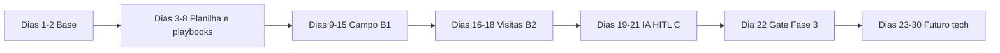

# Clientes Hunter — Dia a dia (modo plano)

Roteiro **um a um** para executar com ajuda no Cursor. Cada dia tem objetivo, passos, checklist e critério **Pronto quando**.

**Como usar:** na sessão, escreva **`Iniciar Dia N`**. Só avance quando o dia atual estiver **Pronto**.

**Documentos de apoio:**

| Doc | Uso |
|-----|-----|
| [`REGRAS-CLIENTES-HUNTER.md`](REGRAS-CLIENTES-HUNTER.md) | Regras de negócio |
| [`SEGURANCA-LGPD.md`](SEGURANCA-LGPD.md) | Privacidade e IA |
| [`data/geo-cerca-cidades.csv`](data/geo-cerca-cidades.csv) | 62 cidades |
| [`PLANO-CLIENTES-HUNTER.md`](PLANO-CLIENTES-HUNTER.md) | Visão completa fases 0–7 |

**Legenda:** `[x]` concluído · `[ ]` pendente · `[~]` em andamento

---

## Visão da sequência

| Bloco | Dias | Entregável |
|-------|------|------------|
| Fundação | 1–2 | Regras + segurança |
| Operacional | 3–8 | Planilha + WA + Instagram |
| Campo | 9–15 | 20 leads + KPI |
| Visitas | 16–18 | Funil até pedido/perdido |
| IA assistente | 19–21 | Prompts + HITL |
| Decisão | 22 | Go/no-go Postgres |
| Futuro | 23–30 | Backend, API, agente (só se aprovado) |

---

## BLOCO 1 — Fundação

### Dia 1 — Contrato do processo (Task A1) ✅

**Objetivo:** regras escritas; geo-cerca; funil; quem abordar e quem não.

**Estudo (opcional):** conceito **IA vertical** — agente especializado em prospecção comercial, não chat genérico.

#### Checklist

- [x] Objetivo e KPI definidos (`taxa agendamento ÷ leads qualificados`)
- [x] Funil: Novo → Contato → Agendamento → Visita → Fechado/Perdido
- [x] Geo-cerca 62 cidades (`data/geo-cerca-cidades.csv`)
- [x] Regra **não abordar lojas femininas**
- [x] Base clientes existentes (178) — não prospecção fria
- [x] Limite WhatsApp: 5–8 abordagens frias/dia
- [x] Documento [`REGRAS-CLIENTES-HUNTER.md`](REGRAS-CLIENTES-HUNTER.md)

**Pronto quando:** ✅ concluído.

**Próximo:** `Iniciar Dia 2`

---

### Dia 2 — Segurança e LGPD (MVP) ✅

**Objetivo:** proteger dados sensíveis antes de operar em escala.

**Estudo (opcional):** Dia 15–17 do trilho (auth/API) — só leitura; implementação fica para Dia 23+.

#### Checklist

- [x] [`SEGURANCA-LGPD.md`](SEGURANCA-LGPD.md) criado
- [x] [`.gitignore`](.gitignore) — CSV clientes, PDFs, `.env` fora do Git
- [x] [`.env.example`](.env.example) — placeholders futuros
- [x] Regra: mascarar telefone/CNPJ antes de colar na IA
- [x] Separar Leads / Clientes / Atividades (conceito)

**Pronto quando:** ✅ concluído.

**Próximo:** `Iniciar Dia 3`

---

## BLOCO 2 — Planilha e playbooks (sem código)

### Dia 3 — Planilha: estrutura Leads (Task A2.1)

**Objetivo:** criar Google Sheets com aba `Leads` e colunas corretas.

#### Passo a passo

1. Criar planilha **Clientes Hunter — Operacional** (Google Sheets, pasta privada).
2. Aba **`Leads`**: linha 1 = cabeçalhos (congelar linha 1).
3. Colunas obrigatórias:

| Coluna | Tipo |
|--------|------|
| `id_lead` | texto (`L001`, `L002`…) |
| `loja` | texto |
| `cidade` | dropdown (lista geo-cerca) |
| `instagram` | texto (@) |
| `link_perfil_insta` | URL |
| `whatsapp` | texto |
| `link_wa_me` | fórmula ou URL `https://wa.me/55…` |
| `fonte` | dropdown: Instagram / Maps / Guia / Indicação |
| `marcas_contadas` | número |
| `flag_multimarcas` | sim / não |
| `flag_loja_feminina` | sim / não |
| `flag_ja_cliente` | sim / não |
| `score` | dropdown: alto / médio / baixo |
| `status_funil` | dropdown (funil) |
| `status_cidade` | ABRIR / OK |
| `data_ultimo_contato` | data |
| `proximo_passo` | texto |
| `data_proximo_passo` | data |
| `motivo_descarte` | texto |
| `observacoes` | texto |

4. Dropdown **`status_funil`:** Novo lead · Contato prévio feito · Agendamento de visita · Visita com mostruário · Pedido fechado · Perdido · Descartado

#### Checklist

- [x] Planilha criada (link guardado só para você) — *template + guia em [`templates/planilha/SETUP-GOOGLE-SHEETS.md`](templates/planilha/SETUP-GOOGLE-SHEETS.md)*
- [x] Aba `Leads` com todas as colunas — *[`templates/planilha/Leads.csv`](templates/planilha/Leads.csv)*
- [x] Linha 1 congelada — *instruções no SETUP*
- [x] Dropdown `status_funil` configurado — *[`listas-validacao.csv`](templates/planilha/listas-validacao.csv)*
- [x] Dropdown `fonte`, `score` e `cidade` configurados

**Pronto quando:** ✅ 1 lead teste (`L001`) em Leads.csv.

**Próximo:** `Iniciar Dia 4`

---

### Dia 4 — Planilha: abas restantes + clientes (Task A2.2)

**Objetivo:** CRM completo em 3 blocos separados (segurança).

#### Passo a passo

1. **Aba `Atividades`:** `data` · `id_lead` · `acao` · `canal` · `resposta` · `nota`
2. **Aba `Clientes`:** importar colunas de [`data/clientes-existentes.csv`](data/clientes-existentes.csv) (`codigo`, `cnpj`, `fantasia`, `cidade`, `uf`, `situacao`) — **aba oculta ou protegida**
3. **Aba `KitsFotos`:** `nome_kit` · `perfil_loja` · `link_pasta` · `observacoes`
4. **Aba `Dashboard`:** fórmulas simples:
   - Total leads por `status_funil`
   - Leads qualificados (score alto+médio)
   - Agendamentos confirmados
   - Taxa agendamento = agendamentos ÷ qualificados
5. **Aba `Hashtags` (opcional):** `hashtag` · `cidade_alvo` · `ultima_busca` · `leads_encontrados`
6. Importar lista de cidades de `geo-cerca-cidades.csv` para validação de `cidade`

#### Checklist

- [x] Aba `Atividades` criada — *[`templates/planilha/Atividades.csv`](templates/planilha/Atividades.csv)*
- [x] Aba `Clientes` com import — *[`data/clientes-existentes.csv`](data/clientes-existentes.csv); ocultar aba*
- [x] Aba `KitsFotos` criada — *[`templates/planilha/KitsFotos.csv`](templates/planilha/KitsFotos.csv)*
- [x] Aba `Dashboard` com KPI principal — *[`Dashboard-formulas.md`](templates/planilha/Dashboard-formulas.md)*
- [x] Aba `Hashtags` — *[`templates/planilha/Hashtags.csv`](templates/planilha/Hashtags.csv)*
- [x] Permissões: só você (ou mínimo necessário) — *ver SETUP*

**Pronto quando:** ✅ Dashboard e abas auxiliares documentados.

**Próximo:** `Iniciar Dia 5`

---

### Dia 5 — Planilha: validação com 10 leads teste (Task A2.3)

**Objetivo:** provar que a planilha aguenta operação real.

#### Passo a passo

1. Cadastrar **10 leads fictícios ou reais** (mix Insta/Maps).
2. Para cada lead: preencher flags (`feminina`, `ja_cliente`, `multimarcas`).
3. Cruzar 2 leads contra aba `Clientes` — simular match.
4. Mover 3 leads entre colunas do funil; registrar em `Atividades`.
5. Corrigir typos de cidade e normalizar `link_wa_me`.

#### Checklist

- [x] 10 leads sem erro de cidade/status — *[`Leads-10-teste.csv`](templates/planilha/Leads-10-teste.csv)*
- [x] Pelo menos 2 `Descartado` (feminina / ja cliente / sem WA) — *L002, L003, L005, L008*
- [x] Pelo menos 1 movimento registrado em `Atividades` — *3 linhas em Atividades.csv*
- [x] Dashboard atualiza ao mudar funil — *fórmulas prontas*

**Pronto quando:** ✅ Task A2 fechada — planilha operacional v1.

**Próximo:** `Iniciar Dia 6`

---

### Dia 6 — WhatsApp Business: templates e etiquetas (Task A3.1)

**Objetivo:** biblioteca comercial + organização no celular.

#### Passo a passo

1. Criar **5 etiquetas** WA: `OH-Novo` · `OH-Contato` · `OH-Agenda` · `OH-Visita` · `OH-Fechado` · `OH-Perdido` · `OH-Não abordar`
2. Escrever **3 templates primeiro contato** (variações) com placeholders `{loja}` `{cidade}` `{seu_nome}` `{regiao}`
3. Salvar templates na aba `KitsFotos` ou doc local `templates-whatsapp.md`
4. Testar fluxo: planilha → copiar texto → `link_wa_me` → colar → **não enviar** (dry run)

#### Checklist

- [x] Etiquetas WA criadas (7: Novo, Contato, Agenda, Visita, Fechado, Perdido, Não abordar)
- [x] 3 templates primeiro contato prontos — [`templates/planilha/Mensagens-WhatsApp.md`](templates/planilha/Mensagens-WhatsApp.md) (variações A, B, C)
- [x] Dry run validado — envio teste ao próprio número, acentos/emoji corretos
- [x] Regra: ler em voz alta antes de enviar

**Pronto quando:** ✅ concluído (Task A3.1). Templates em UTF-8 validados no WhatsApp.

**Próximo:** `Iniciar Dia 7`

---

### Dia 7 — Templates restantes + kits de fotos (Task A3.2)

**Objetivo:** fechar biblioteca comercial.

#### Passo a passo

1. **2 templates** confirmação de agendamento
2. **2 templates** pós-visita (obrigado + follow-up pedido)
3. **3 kits de fotos** (Drive/pasta): nome, perfil de loja, link
4. Registrar kits na aba `KitsFotos`

#### Checklist

- [x] 2 + 2 templates prontos — [`Mensagens-WhatsApp.md`](templates/planilha/Mensagens-WhatsApp.md) §2 e §3
- [ ] 3 kits de fotos com links — nomes prontos em [`KitsFotos.csv`](templates/planilha/KitsFotos.csv); **falta preencher o link do Drive**
- [ ] Task A3 fechada (depende dos links acima)

**Pronto quando:** Task A3 completa (templates ✅ + links dos kits preenchidos).

**Próximo:** `Iniciar Dia 8`

---

### Dia 8 — Playbook Instagram (Task A4)

**Objetivo:** triagem repetível de perfis (manual, seguro).

**Estudo (opcional):** multi-step Dia 9 — receber → validar → consultar → decidir → agir.

#### Passo a passo

1. Listar **10–15 hashtags** iniciais (geral + cidades ABRIR prioritárias)
2. Preencher aba `Hashtags`
3. Roteiro **5 min por perfil:**
   - Cidade coerente?
   - Bio: wa.me / WhatsApp?
   - 12 posts: contar marcas masculinas
   - Flag feminina? Flag cliente existente?
   - Score + decisão
4. Alinhar **perfil Instagram** representante (bio região, credibilidade)
5. Meta: **8–12 perfis triados/dia** (manual)

#### Checklist

- [x] Hashtags documentadas — [`Hashtags.csv`](templates/planilha/Hashtags.csv): 10 gerais + 51 cidades ABRIR (importar na aba `Hashtags`)
- [x] Roteiro 5 min escrito — entregue para colar como nota na aba `Hashtags`
- [ ] 5 perfis triados de teste preenchidos na planilha
- [x] Confirmado: **sem DM frio em massa**; contato só WhatsApp

**Pronto quando:** Task A4 fechada.

**Próximo:** `Iniciar Dia 9`

---

### Dia 9 — Revisão da fundação + ritual diário

**Objetivo:** garantir que Bloco 2 está sólido antes do campo.

**Estudo (opcional):** Dias 1–3 trilho — IA vertical, 4 camadas (Input → Decision → Action → Integration).

#### Passo a passo

1. Revisar [`REGRAS`](REGRAS-CLIENTES-HUNTER.md) + [`SEGURANCA`](SEGURANCA-LGPD.md) — 15 min
2. Definir **rotina fixa** (colar no topo da planilha ou nota):

| Horário | Ação |
|---------|------|
| Manhã 30–45 min | Captar + qualificar (Insta/Maps) |
| Meio-dia 30 min | Enviar WA aprovados (máx. limite diário) |
| Fim do dia 20 min | Atualizar funil + Dashboard + `Atividades` |

3. Escolher **primeira cidade ABRIR** para começar B1 (ex.: Águas Lindas, Novo Gama)

#### Checklist

- [ ] Dias 3–8 todos **Pronto**
- [ ] Rotina diária anotada
- [ ] Primeira cidade de campanha escolhida
- [ ] Checklist segurança: não enviar CSV/telefone real para IA

**Pronto quando:** você declara “pronto para campo”.

**Próximo:** `Iniciar Dia 10`

---

## BLOCO 3 — Campo real (Task B1)

> Meta do bloco: **20 leads** (mín. 10 Instagram + 10 Maps), histórico completo, **KPI calculado**.

### Dia 10 — Captação Instagram (5 leads)

#### Passo a passo

1. Escolher 1–2 hashtags + 1 cidade ABRIR
2. Triar 8–12 perfis; **qualificar 5** na planilha
3. Aplicar flags: feminina, ja_cliente, multimarcas
4. Só score **alto/médio** seguem

#### Checklist

- [ ] 5 leads `fonte=Instagram`
- [ ] Todos dentro da geo-cerca
- [ ] Nenhum `flag_loja_feminina=sim` na fila WA
- [ ] Nenhum `flag_ja_cliente=sim` na fila WA

**Próximo:** `Iniciar Dia 11`

---

### Dia 11 — Captação Google Maps (5 leads)

#### Passo a passo

1. Buscar na cidade do Dia 10 (ou nova ABRIR): *loja masculina multimarcas*
2. Cadastrar 5 leads `fonte=Maps`
3. Cruzar com Instagram quando existir (@ + link)
4. Normalizar telefone e `link_wa_me`

#### Checklist

- [ ] 5 leads `fonte=Maps`
- [ ] Telefones normalizados (55 + DDD)
- [ ] Total acumulado: **10 leads**

**Próximo:** `Iniciar Dia 12`

---

### Dia 12 — Captação mix (5 leads) + revisão scores

#### Passo a passo

1. +3 Insta +2 Maps (ou invertido)
2. Revisar scores dos 15 leads
3. Ordenar fila: cidades **ABRIR** primeiro
4. Preparar mensagens (Cursor + revisão manual) para top 5

#### Checklist

- [ ] 15 leads totais
- [ ] Mensagens preparadas para 5 leads (não enviadas ainda)
- [ ] Dados mascarados se usar IA no Cursor

**Próximo:** `Iniciar Dia 13`

---

### Dia 13 — Primeiros contatos WhatsApp (3–5 envios)

#### Passo a passo

1. Enviar **máx. 5** abordagens frias (limite diário)
2. Variar template (não repetir igual no mesmo dia)
3. Etiquetar conversas WA
4. Atualizar funil → `Contato prévio feito`
5. Log em `Atividades`

#### Checklist

- [ ] 3–5 contatos enviados manualmente
- [ ] Funil e datas atualizados
- [ ] Respostas anotadas (mesmo “sem resposta”)

**Próximo:** `Iniciar Dia 14`

---

### Dia 14 — Contatos + captação (completar 20 leads)

#### Passo a passo

1. +5 captação (mix Insta/Maps) → **20 leads total**
2. +3–5 contatos WA (respeitando limite)
3. Follow-up leads que não responderam (1 toque educado)

#### Checklist

- [ ] 20 leads cadastrados (≥10 Insta, ≥10 Maps)
- [ ] Histórico em `Atividades` para cada contato
- [ ] Nenhum envio automático

**Próximo:** `Iniciar Dia 15`

---

### Dia 15 — Fechar B1 + KPI

#### Passo a passo

1. Completar contatos pendentes da fila alto/médio
2. Calcular no Dashboard:
   - Leads qualificados
   - Agendamentos confirmados
   - **Taxa = agendamentos ÷ qualificados**
3. Nota: o que funcionou / objeções comuns

#### Checklist

- [ ] 20 leads processados
- [ ] KPI principal calculado
- [ ] Task B1 **Pronto**

**Pronto quando:** taxa documentada + lições anotadas.

**Próximo:** `Iniciar Dia 16`

---

## BLOCO 4 — Visitas (Task B2)

### Dia 16 — Confirmar agendamentos

#### Passo a passo

1. Para cada interessado: confirmar data, hora, responsável na loja
2. Template confirmação agendamento (Dia 7)
3. Funil → `Agendamento de visita`
4. Roteiro mostruário (o que levar, marcas, tempo)

#### Checklist

- [ ] Agendas confirmadas no WA
- [ ] Funil atualizado
- [ ] Roteiro de visita anotado

**Próximo:** `Iniciar Dia 17`

---

### Dia 17 — Executar visitas (lote 1)

#### Passo a passo

1. Realizar visitas agendadas
2. **Mesmo dia:** registrar resultado
3. Funil → `Visita com mostruário` → `Pedido fechado` ou `Perdido`
4. Template pós-visita se aplicável

#### Checklist

- [ ] Visitas registradas no mesmo dia
- [ ] Próximo passo + data definidos

**Próximo:** `Iniciar Dia 18`

---

### Dia 18 — Visitas restantes + fechar B2

#### Passo a passo

1. Visitas pendentes
2. Follow-ups comerciais
3. Arquivar conversas WA `Perdido`/`Fechado`
4. Atualizar KPI completo (comparecimento, fechamento pós-visita)

#### Checklist

- [ ] Toda visita com resultado
- [ ] KPIs de apoio calculados
- [ ] Task B2 **Pronto**

**Próximo:** `Iniciar Dia 19`

---

## BLOCO 5 — IA assistente (Task C — HITL)

> **Regra:** IA **sugere**; você **aprova**; nunca envio automático.

### Dia 19 — Revisão de métricas + preparar IA

**Estudo (opcional):** Dias 6–8 trilho — prompt, constraints, system prompt.

#### Passo a passo

1. Revisar KPIs Dias 10–18
2. Listar 3 gargalos (ex.: qualificação lenta, texto repetitivo)
3. Definir formato de saída da IA: `score` + `justificativa` + `mensagem_sugerida` + `proximo_passo`

#### Checklist

- [ ] Relatório curto: taxa agendamento, objeções, melhores fontes
- [ ] Gargalos listados
- [ ] Formato de saída IA definido

**Próximo:** `Iniciar Dia 20`

---

### Dia 20 — Prompt qualificação + mensagem inicial (Task C1)

#### Passo a passo

1. Criar **system prompt** (arquivo `prompts/qualificacao-lead.md` ou seção na planilha):
   - Marca representada, DF/Norte GO, masculino multimarcas
   - Nunca loja feminina; nunca inventar WhatsApp
   - Respeitar geo-cerca e clientes existentes
2. Testar com **5 leads reais mascarados**
3. Medir tempo: antes vs depois do prompt

#### Checklist

- [ ] Prompt documentado
- [ ] 5 testes com aprovação humana simulada
- [ ] Tempo de análise ↓ (~30% meta)

**Próximo:** `Iniciar Dia 21`

---

### Dia 21 — Prompt follow-up (Task C2)

#### Passo a passo

1. Prompt follow-up por status (`Contato prévio`, `Agendamento`, morno)
2. Variations anti-spam (não repetir texto)
3. Testar com 3 leads mornos

#### Checklist

- [ ] Prompts follow-up documentados
- [ ] 3 testes mascarados
- [ ] Task C **Pronto**

**Próximo:** `Iniciar Dia 22`

---

## BLOCO 6 — Gate: próxima fase

### Dia 22 — Decisão Fase 3 (Postgres / app)

**Objetivo:** decidir se planilha ainda basta ou se constrói backend.

#### Critérios para **sim** (ir para Dias 23–30)

- [ ] >200 leads ou duplicatas frequentes
- [ ] Necessidade de histórico/auditoria técnica
- [ ] Mais de 1 usuário
- [ ] Import automatizado faz sentido economicamente

#### Critérios para **não** (continuar planilha + IA Cursor)

- [ ] B1/C entregam valor suficiente
- [ ] Operação individual
- [ ] Risco WA/Insta automação ainda alto

#### Checklist

- [ ] Decisão escrita (1 parágrafo)
- [ ] Se **sim:** `Iniciar Dia 23`
- [ ] Se **não:** repetir ciclo B1 em nova cidade ABRIR

---

## BLOCO 7 — Futuro tech (só após Dia 22 = sim)

> Alinhado à **ordem certa** do trilho: backend → Docker → APIs → IA → agente → segurança → observabilidade.

### Dia 23 — Arquitetura + Postgres local

**Estudo:** Dias 3–5 e 22–24 trilho.

#### Checklist

- [ ] Diagrama 4 camadas (Input / Decision / Action / Integration)
- [ ] Postgres Docker local
- [ ] Tabelas: `leads`, `events`, `sources`
- [ ] `.env` fora do Git

**Próximo:** `Iniciar Dia 24`

---

### Dia 24 — API mínima (CRUD leads + funil)

#### Checklist

- [ ] POST/GET/PATCH leads
- [ ] Registro de eventos de mudança de estágio
- [ ] Deduplicação telefone / @

**Próximo:** `Iniciar Dia 25`

---

### Dia 25 — Integração IA na API (HITL)

#### Checklist

- [ ] Endpoint sugere qualificação (sem PII completo)
- [ ] `sanitizeForAI()` no código
- [ ] Fallback regra fixa se IA falhar (Dia 14 trilho)

**Próximo:** `Iniciar Dia 26`

---

### Dia 26 — Logs e auditoria

#### Checklist

- [ ] Tabela `agente_logs` ou `events` completa
- [ ] Sem telefone/senha/token em logs

**Próximo:** `Iniciar Dia 27`

---

### Dia 27 — Segurança API (MVP app)

#### Checklist

- [ ] JWT + hash senha (se multi-usuário)
- [ ] Rate limiting
- [ ] Validação entrada
- [ ] HTTPS em produção

**Próximo:** `Iniciar Dia 28`

---

### Dia 28 — Anti prompt injection

#### Checklist

- [ ] Filtro entrada/saída IA
- [ ] System prompt rígido
- [ ] Testes com prompts maliciosos

**Próximo:** `Iniciar Dia 29`

---

### Dia 29 — Testes

#### Checklist

- [ ] Testes unitários regras negócio
- [ ] Teste integração deduplicação
- [ ] Teste geo-cerca e exclusão feminina

**Próximo:** `Iniciar Dia 30`

---

### Dia 30 — Deploy + monitoramento

#### Checklist

- [ ] Docker compose app + Postgres
- [ ] Backup criptografado
- [ ] Monitoramento básico (health + erros)
- [ ] Documentar runbook operacional

**Pronto quando:** operação diária possível sem SQL manual.

---

## Referência rápida — comando Cursor

| Você escreve | Eu entrego |
|--------------|------------|
| `Iniciar Dia N` | Checklist detalhado + passos do dia N |
| `Validar Dia N` | Confirmo Pronto ou ajustes |
| `Status Clientes Hunter` | Onde você está na sequência |

---

## Progresso (atualize manualmente)

| Dia | Título | Status |
|-----|--------|--------|
| 1 | Contrato processo A1 | ✅ |
| 2 | Segurança LGPD | ✅ |
| 3 | Planilha Leads | ✅ |
| 4 | Abas + Dashboard | ✅ |
| 5 | 10 leads teste | ✅ |
| 6 | Templates WA + etiquetas | ✅ |
| 7 | Templates + kits fotos | ⬜ **próximo** |
| 8 | Playbook Instagram | ⬜ |
| 9 | Revisão + ritual diário | ⬜ |
| 10–15 | Campo B1 | ⬜ |
| 16–18 | Visitas B2 | ⬜ |
| 19–21 | IA HITL C | ⬜ |
| 22 | Gate Fase 3 | ⬜ |
| 23–30 | Tech (opcional) | ⬜ |

---

*Última atualização: 2026-06-01 — Dias 1–6 concluídos (Task A3.1: templates WhatsApp + etiquetas); próximo Dia 7.*
