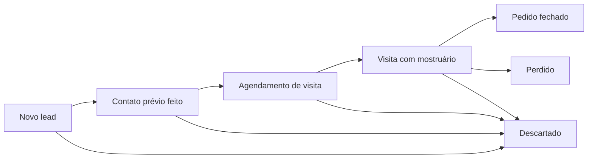

# Clientes Hunter

Sistema de captação e prospecção comercial para representantes de moda masculina no **DF** e **Norte de Goiás**. Encontra lojas multimarcas no Instagram e Google Maps, qualifica leads por score e geo-cerca, organiza contato WhatsApp com aprovação humana e acompanha o funil Kanban até visita com mostruário. **MVP operacional em Google Sheets.**

[](#progresso)
[](#stack-atual)
[](SEGURANCA-LGPD.md)
[](LICENSE)

**Pitch (1 linha):** Prospecção B2B multimarcas com geo-cerca, score e funil até agendamento — MVP manual com KPI e LGPD documentada.

**Trilha portfólio:** [`TRILHA-DIA-A-DIA.md`](TRILHA-DIA-A-DIA.md) · **5 etapas (visual):** [`docs/portfolio/etapas.md`](docs/portfolio/etapas.md) · **Roteiro operacional:** [`DIA-A-DIA-CLIENTES-HUNTER.md`](DIA-A-DIA-CLIENTES-HUNTER.md)

---

## O que resolve

Representantes comerciais perdem tempo com leads ruins (loja feminina, fora da área, cliente existente, multimarcas falso). O Clientes Hunter **filtra**, **prioriza** e **organiza** o caminho até o agendamento de visita presencial — onde a venda acontece com mostruário.

**KPI principal:** `agendamentos confirmados ÷ leads qualificados`

---

## Stack atual (MVP)

| Camada | Tecnologia |
|--------|------------|
| CRM | Google Sheets |
| Dados | CSV + templates versionados |
| Captação | Instagram + Google Maps (manual) |
| Contato | WhatsApp Business (manual, HITL) |
| IA | Cursor — sugere, humano aprova |
| Docs | Markdown |
| Futuro | PostgreSQL, n8n, Evolution API (pós Dia 22) |

---

## Progresso

| Bloco | Status |
|-------|--------|
| Dias 1–2 — Regras + LGPD | ✅ |
| Dias 3–5 — Planilha operacional v1 | ✅ |
| Dias 6–7 — Templates WhatsApp | ✅ |
| Dias 8–9 — Playbook Insta + revisão | ⬜ **próximo** (Dia 8 parcial: roteiro ✅) |
| Dias 10–15 — Campo real (20 leads) | ⬜ |
| Dias 16–22 — Visitas + IA + gate backend | ⬜ |

Detalhe: [`DIA-A-DIA-CLIENTES-HUNTER.md`](DIA-A-DIA-CLIENTES-HUNTER.md)

---

## Estrutura do repositório

```
Clientes Hunter/
├── README.md                 ← você está aqui
├── LICENSE                   ← MIT
├── TRILHA-DIA-A-DIA.md       ← trilha portfólio (Helder + skills-pessoal)
├── CONTEXT.md                ← vocabulário canônico
├── CONTRIBUTING.md           ← guia para colaboradores
├── CHECKLIST_FINAL.md        ← auditoria pré-push (4 especialistas)
├── PLANO-CLIENTES-HUNTER.md  ← visão completa fases 0–7
├── REGRAS-CLIENTES-HUNTER.md ← regras de negócio
├── DIA-A-DIA-CLIENTES-HUNTER.md
├── SEGURANCA-LGPD.md
├── .env.example
├── docs/portfolio/etapas.md  ← narrativa 5 etapas + Mermaid
├── data/
│   ├── geo-cerca-cidades.csv      ← 62 cidades (público)
│   └── clientes-existentes.example.csv
└── templates/planilha/            ← importar no Google Sheets
```

---

## Começar rápido

### Colaborador (dev)

1. Clone o repositório
2. Leia [`CONTRIBUTING.md`](CONTRIBUTING.md) — **obrigatório**
3. Leia [`SEGURANCA-LGPD.md`](SEGURANCA-LGPD.md) — dados sensíveis
4. Importe planilha: [`templates/planilha/SETUP-GOOGLE-SHEETS.md`](templates/planilha/SETUP-GOOGLE-SHEETS.md)
5. Peça ao titular o `data/clientes-existentes.csv` real (fora do Git)
6. Siga [`TRILHA-DIA-A-DIA.md`](TRILHA-DIA-A-DIA.md) ou no Cursor: `Iniciar Dia 7`

### Representante (operação)

| Comando Cursor | Ação |
|----------------|------|
| `Iniciar Dia N` | Checklist do dia |
| `Validar Dia N` | Confirmar se está pronto |
| `Status Clientes Hunter` | Ver progresso |

---

## Funil de prospecção

Narrativa das 5 etapas + diagrama detalhado: [`docs/portfolio/etapas.md`](docs/portfolio/etapas.md).



Screenshot da planilha demo (dados fictícios): `docs/screenshots/planilha-demo.png` — guia: [`docs/screenshots/README.md`](docs/screenshots/README.md).

Regras completas: [`REGRAS-CLIENTES-HUNTER.md`](REGRAS-CLIENTES-HUNTER.md)

---

## Segurança

- **Nunca commitar:** CNPJ/telefones reais, PDFs de clientes, `.env`
- **Mascarar** dados antes de usar IA
- **5–8** abordagens WhatsApp frias por dia
- Ver [`.gitignore`](.gitignore) e [`SEGURANCA-LGPD.md`](SEGURANCA-LGPD.md)

---

## Documentação

| Documento | Conteúdo |
|-----------|----------|
| [`TRILHA-DIA-A-DIA.md`](TRILHA-DIA-A-DIA.md) | Trilha portfólio dia a dia |
| [`docs/portfolio/etapas.md`](docs/portfolio/etapas.md) | 5 etapas + Mermaid (portfólio) |
| [`CONTEXT.md`](CONTEXT.md) | Vocabulário e KPIs |
| [`CONTRIBUTING.md`](CONTRIBUTING.md) | Como colaborar + fluxo 4 especialistas |
| [`CHECKLIST_FINAL.md`](CHECKLIST_FINAL.md) | Auditoria pré-envio |
| [`PLANO-CLIENTES-HUNTER.md`](PLANO-CLIENTES-HUNTER.md) | Plano completo (fases 0–7) |
| [`REGRAS-CLIENTES-HUNTER.md`](REGRAS-CLIENTES-HUNTER.md) | Qualificação, geo-cerca, limites |
| [`DIA-A-DIA-CLIENTES-HUNTER.md`](DIA-A-DIA-CLIENTES-HUNTER.md) | Roteiro 30 dias |
| [`SEGURANCA-LGPD.md`](SEGURANCA-LGPD.md) | Privacidade e IA |
| [`templates/planilha/`](templates/planilha/) | CSVs para Google Sheets |

---

## Roadmap técnico

1. **Agora** — Planilha + templates + campo manual
2. **Fase 2** — Telegram/n8n (alertas)
3. **Fase 3** — PostgreSQL + API (após gate Dia 22)
4. **Fase 4–5** — Import Maps + enriquecimento Instagram
5. **Fase 6–7** — WhatsApp semi-auto + painel Kanban

---

## Portas reservadas (portfólio)

MVP atual **sem** backend/Docker. Portas reservadas para fase futura (não implementar sem ADR):

| Camada | Porta host |
|--------|------------|
| API (futuro) | 8085 |
| Frontend (futuro) | 5178 |
| Postgres (futuro) | 5435 |

Inventário local de portas do portfólio (fora deste repositório).

---

## Licença

Este projeto está licenciado sob a **[MIT License](LICENSE)**.

Copyright (c) 2026 Helder Abud

Você pode usar, copiar, modificar e distribuir o código e a documentação deste repositório, desde que inclua o aviso de copyright e o texto completo da licença em redistribuições relevantes.

> **Dados operacionais:** arquivos listados no [`.gitignore`](.gitignore) (ex.: `data/clientes-existentes.csv`, `.env`) **não** fazem parte do que é publicado no Git e permanecem sob sua responsabilidade local, conforme [`SEGURANCA-LGPD.md`](SEGURANCA-LGPD.md).
