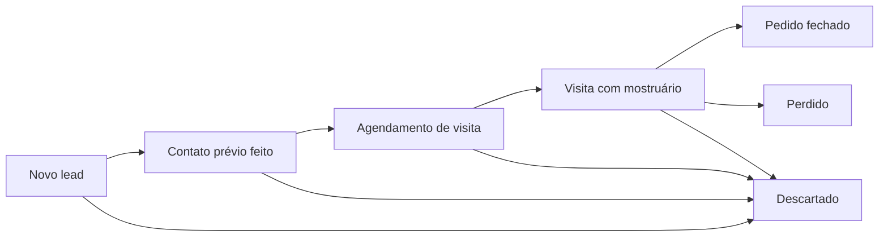

# Portfólio — 5 etapas operacionais (Clientes Hunter)

> Evidência de produto/operação para GitHub e LinkedIn.  
> **Sem dados reais** (telefones, CNPJ, clientes existentes).  
> Vocabulário: [`CONTEXT.md`](../../CONTEXT.md) · Regras: [`REGRAS-CLIENTES-HUNTER.md`](../../REGRAS-CLIENTES-HUNTER.md)

---

## Visão em uma frase

Prospecção B2B de lojas masculinas multimarcas no DF e Norte de GO: geo-cerca → planilha → WhatsApp HITL → Instagram manual → KPI de agendamento.

---

## Funil (`status_funil`)

Qualquer ponto do funil pode ir para **Descartado** com `motivo_descarte` padronizado (ex.: `Fora da geo-cerca`, `Loja feminina`, `Opt-out`).

---

## Etapa 1 — Regras + geo-cerca

**Tags:** `Geo-cerca`

Contrato mínimo de quem entra na prospecção fria:

- Cidade em [`data/geo-cerca-cidades.csv`](../../data/geo-cerca-cidades.csv) (lista fechada DF + Norte GO)
- Perfil masculino / multimarcas real (≥ 4 marcas masculinas)
- Indício de WhatsApp; **não** cliente existente
- Loja exclusivamente feminina ou fora da geo-cerca → `Descartado`

**Artefatos:** `CONTEXT.md`, `REGRAS-CLIENTES-HUNTER.md`, CSV de cidades.

---

## Etapa 2 — Planilha operacional v1

**Tags:** `HITL` · `Geo-cerca`

Google Sheets + templates CSV versionados: leads, `status_funil`, score (Alto/Médio/Baixo), fonte, motivo de descarte.

**Artefatos:** [`templates/planilha/`](../../templates/planilha/) · setup em `SETUP-GOOGLE-SHEETS.md`.

Screenshot demo (dados fictícios): ainda não versionado — guia de captura: [`docs/screenshots/README.md`](../screenshots/README.md). Quando existir, salvar como `docs/screenshots/planilha-demo.png`.

---

## Etapa 3 — Templates WhatsApp HITL

**Tags:** `HITL`

Mensagem sugerida por template/IA; **envio sempre manual** após revisão humana.

Limites: 5–8 abordagens frias/dia · 1 por loja/dia · 9h–17h (nunca após 18h) · opt-out nunca reabordado.

**Artefatos:** templates WhatsApp · ADR WhatsApp manual · [`SEGURANCA-LGPD.md`](../../SEGURANCA-LGPD.md).

---

## Etapa 4 — Captação Instagram manual

**Tags:** `HITL` · `Geo-cerca`

Triagem manual de perfis **públicos**: 8–12/dia. Sem bot logado, scraping em massa ou DM fria em massa.

Lead entra como `Novo lead` na planilha após triagem humana.

**Artefatos:** playbook Instagram (grill-logs Dia 8) · limites em `REGRAS`.

---

## Etapa 5 — KPI e fechamento do ciclo

**Tags:** `KPI` · `HITL`

KPI principal: **agendamentos confirmados ÷ leads qualificados** (só prospecção fria; reativação não entra).

Ciclo: qualificar → abordar → agendar visita com mostruário → registrar resultado no funil.

**Artefatos:** `CONTEXT.md` (KPIs) · resultados agregados futuros em `docs/resultados-piloto.md` (sem PII).

---

## O que este MVP não é (ainda)

Até o gate Dia 22: sem PostgreSQL, API, n8n, Evolution API ou painel Kanban automatizado. Stack atual = Sheets + CSV + Markdown + Cursor + WhatsApp Business manual.
